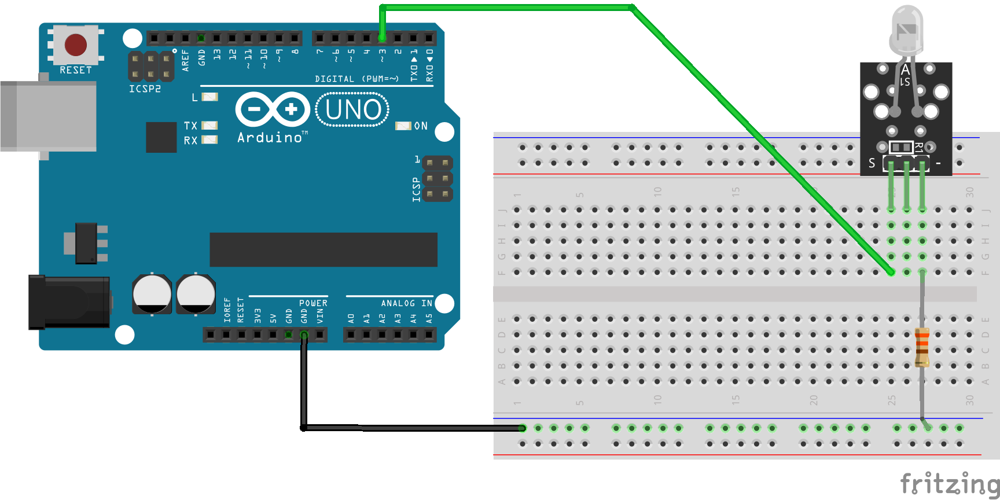

# TivoBruteForce
Arduino sketch to try all 10,000 Pin Numbers against a TiVo HD.
## Overview
The TiVo Series 3 / HD unit was sold in Australia and New Zealand from 2008 until approximately 2013. The Electronic Program Guide information was provided until October 2017, when the service was closed down.

[Darren King](http://kingey1971.wixsite.com/tivorepairs) spearheaded a volunteer effort to maintain service through the [OzTiVo](http://www.oztivo.net/twiki/bin/view) community - with many users coming from the [Whirlpool](https://forums.whirlpool.net.au/archive/2613609) forum.

I discovered that I had lost the Passcode for the KidZone functionality, and the TiVo unit was stuck in the KidZone.

The accompanying Arduino Sketch and Fritzing model are a basic circuit I created to [brute force](https://en.wikipedia.org/wiki/Brute-force_search) all the possible Passcodes.

These instructions assume some basic familiarity with electronic circuits and Arduino programming. This is a fairly simple circuit and should be able to be constructed with only minimal experience.

## Prerequisites
1. TiVo HD / Series 3 - Australian / New Zealand model.
1. [Arduino Uno] (https://www.littlebird.com.au/arduino-uno-r3) or similar. I tested using an Arduino Uno Rev 1 and also a SparkFun [MicroView](https://www.sparkfun.com/products/12923).
1. USB cable to suit your Arduino.
1. IR Transmitter Module or similar. I used a [Jaycar IR Transmitter Module](https://www.jaycar.com.au/arduino-compatible-infrared-transmitter-module/p/XC4426) however a [KY-005](https://arduinomodules.info/ky-005-infrared-transmitter-sensor-module/) or plain IR LED (taking note of the polarity of the LED) will also work.
1. 330Ω 125mW Through Hole Resistor (a 220Ω or 100Ω resistor should also work).
1. Prototyping [Breadboard](https://www.littlebird.com.au/breadboard-self-adhesive-white).
1. Breadboard [Jumper Wire](https://www.littlebird.com.au/1-pin-dual-male-breadboard-jumper-wire-75pcs-pack).
1. USB Power Pack / Charger (Optional) if you cannot connect your Arduino to your computer within reach of your TiVo. 
## Software
The following software and library modules are all free to use, and are required for the sketch to work.
1. [Arduino IDE](https://www.arduino.cc/en/main/software) - I used the "Download" version. The sketch is fairly simple, so the Web Editor will probably work too.
1. [IRLib2](https://github.com/cyborg5/IRLib2/archive/master.zip) - After running the Arduino IDE, download the IRLib2 and extract into the `...Documents\Arduino\libraries` folder.
## Useful Links
* [Overview of IRLib2](https://learn.adafruit.com/using-an-infrared-library/overview) on the AdaFruit website, written by the library author, [Chris Young](https://github.com/cyborg5/IRLib2).
## Thankyou
* [Darren King](http://kingey1971.wixsite.com/tivorepairs) for helping many many people continue using their TiVo's after the EPG service ended.
* The [OzTivo](http://www.oztivo.net/twiki/bin/view) community for hosting the new EPG, Forum, and supporting all the new users.
* Chris from [AnalysIR](https://www.AnalysIR.com/blog/) for some great IR analysis code and hardware modules, and some excellent advice.
## Instructions
1. Install the [Arduino IDE](https://www.arduino.cc/en/main/software).
1. Run the Arduino IDE (to create your local library folders).
1. Download the [IRLib2](https://github.com/cyborg5/IRLib2/archive/master.zip) library packages and extract under your `...Documents\Arduino\libraries` folder - noting that the contained folders should go directly under `libraries` - there should be no intermediate folders.
1. Plug your Arduino Uno into the USB Cable and then into your computer.
1. If you have not previously used an Arduino, I suggest trying to run the [Arduino Blink Tutorial](https://www.arduino.cc/en/tutorial/blink) - note that if you have an Arduino Uno, you do not need any extra components as there is a built in LED on the Arduino Uno board.
1. Assemble the Arduino, IR Module, and Resister as per the [Fritzing]() diagram.
    
    1. Arduino Pin 3 connects to the S Pin on the IR Transmitter.
    1. The -ve Pin on the IR Transmitter connects to the 330Ω Resistor.
    1. The other end of the 330Ω Resistor connects to the GND Power Pin on the Arduino.
1. Open the [TivoBruteForce](TivoBruteForce.ino) sketch in the Arduino IDE.
1. Compile the sketch.
1. Upload the sketch.
1. Open the Serial Monitor window `Tools - Serial Monitor`.
1. Look for the status logs as it runs. The current passcode will be shown. Note that the first digit represents the "10,000" passcode batch that is processing. "1" indicates that this is the first time that the number has been attempted. 
    ```    
    00:10:14.020 -> Number: 10000
    00:10:14.052 -> Digit 0 A10C8C03
    00:10:14.638 -> Digit 0 A10C8C03
    00:10:15.257 -> Digit 0 A10C8C03
    00:10:15.875 -> Digit 0 A10C8C03
    00:10:16.458 -> Number: 10001
    00:10:16.491 -> Digit 0 A10C8C03
    00:10:17.073 -> Digit 0 A10C8C03
    00:10:17.686 -> Digit 0 A10C8C03
    00:10:18.302 -> Digit 1 A10C140B
    00:10:18.919 -> Number: 10002
    00:10:18.919 -> Digit 0 A10C8C03
    00:10:19.533 -> Digit 0 A10C8C03
    00:10:20.150 -> Digit 0 A10C8C03
    00:10:20.730 -> Digit 2 A10C940B
    ```
1. Once you have confirmed the sketch is working, unplug the USB Cable and relocate the Arduino Uno and Breadboard with IR Transmitter Module so that the IR module is pointing at the TiVo, and is 5-10 centimetres away - approximately pointing to the middle of the front panel.
1. In the `KidZone Now Playing` screen, highlight the `Exit TiVo KidZone` menu entry.
1. Press `Select` on your remote control.
1. The Four Passcode boxes will be displayed.
1. Plug the USB Cable into the Arduino.
1. You will see the TiVo logo appear in the passcode boxes.
1. Leave the Arduino / Transmitter plugged in and running overnight. It will take 8-13 hours to find the correct combination.
1. Note that this will only unlock the KidZone. You will have to repeat this process if you want to change the password, or remove KidZone completely.
## Options to Improve Performance
* You can speed up the submission by reducing the number of milliseconds the sketch pauses between each digit. I have tested down to 300 milliseconds - however you may start to receive errors in transmission. You should ensure the transmitter is reasonably close to the TiVo.
Modify the number in the line `delay(500);` to reflect your desired value.
* Increase the Serial speed. Find the line `Serial.begin(9600);` and change the number to `115200` giving you `Serial.begin(115200);`. In the Serial Monitor, change the speed (bottom right status bar) from `9600 baud` to `115200 baud`. Do not go higher than 115200. The Serial rate *MUST* match between the sketch code and the Serial Monitor.
## Possible Enhancements (if I need to do this again)
* Use a 4 Digit, 7 Segment Display for output.
* Investigate lower delay times between digits. The lowest attempted value was 300 milliseconds. Perhaps make this configurable using microswitches.
* Document the sketch used with the [MicroView](https://www.sparkfun.com/products/12923) for recording the current Passcode attempt. This was left out to provide the simplest solution for people.
* Investigate using SSH direct to the TiVo to find if the Passcode is stored somewhere, or see if the [Network Remote Control](https://github.com/wmcbrine/tivoremote) is an option.
* It would be lovely to determine some way of knowing when the Passcode works, however I don't believe the Tivo HD sends any IR signal out. One thought would be to look for colour changes in the screen however this would be complex to implement.
